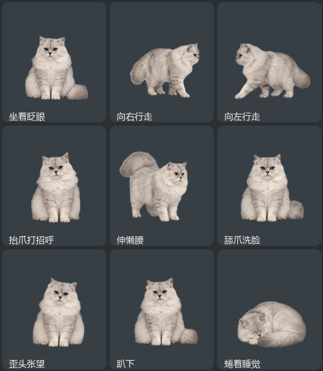
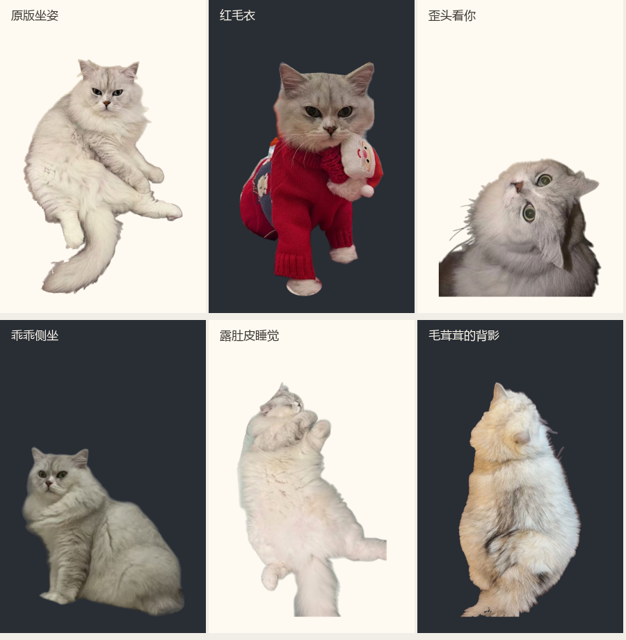
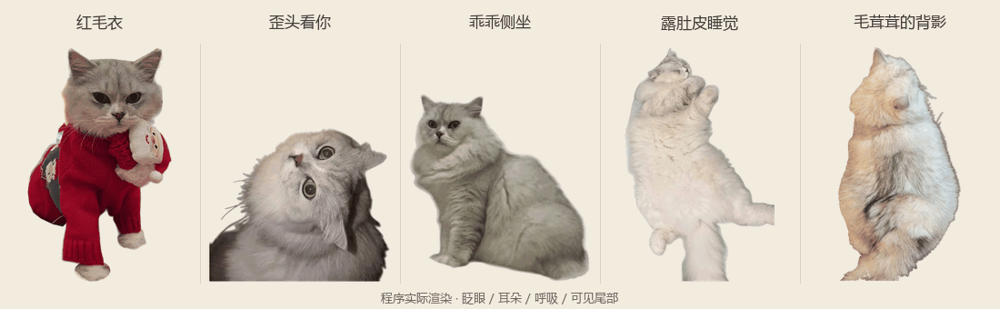
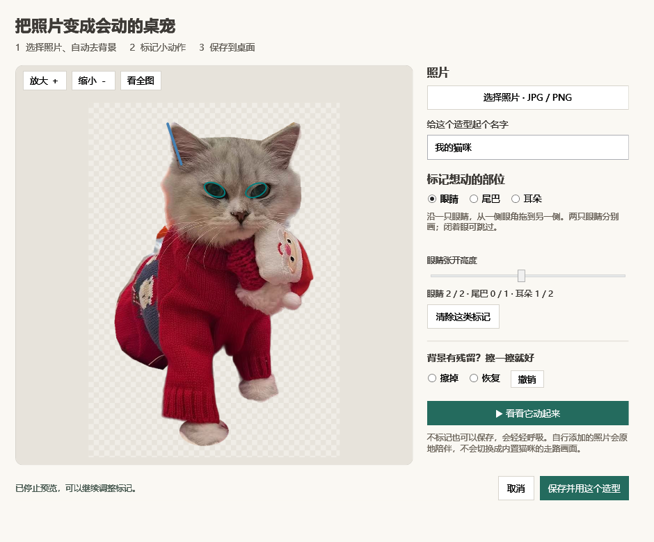

# 猫咪桌宠 · Desktop Pets

给我的好闺闺的桌宠。

目前维护给朋友使用的 Windows 桌宠成品。历史跨平台试验代码保留在 [platform/](platform/README.md)，暂不继续开发网站或商业化功能。

下文是可直接发给朋友的 **Windows 成品 v0.4.5**，基于原来的 v0.4 系列继续改进。这个 EXE 已内置朋友这只猫，无需制作或导入宠物包。

Windows 桌面猫咪陪伴程序：默认会自己走动、眨眼、抬爪、伸懒腰和打盹。也可换回原照片造型，使用原有的眼睛、耳朵和尾巴局部小动作。

当前版本：**v0.4.5 · 9 组猫咪动作，57 帧**。新增“动作版”造型，使用这只猫的透明精灵图，自动眨眼、左右行走、抬爪、伸懒腰、舔爪、歪头、趴下和睡觉。原来的六种照片造型、自选照片编辑、离线抠图和 DeepSeek 聊天继续保留。

第一次运行默认使用“动作版”；更新后会保留你之前选中的造型。如果仍显示旧照片，右键猫咪 → **换造型 → 动作版 · 9组新动作**。



新造型由内置 imagegen 参考原猫照片生成，再在本机去背景和统一对齐；属于照片衍生动作，仍可能有少量逐帧毛发、脸部和步态变化。[素材与播放说明](docs/sprite-actions.md)。

原照片造型直接使用主人提供的不同照片，经本地抠图后切换，包含原版坐姿、红毛衣、歪头、侧坐、露肚皮睡觉和背影。原有行走、伸展和趴睡动作素材沿用 v0.4 的照片衍生素材。






## 下载运行

从 [v0.4.5 下载页](https://github.com/flyallz/desktop_pets/releases/tag/v0.4.5) 下载 `DesktopPets-0.4.5-win-x64.exe`，双击即可运行。图片已经装在 EXE 里，朋友无需安装制作工具。更新前先通过猫咪或托盘的右键菜单退出旧版。完整 EXE 约 204 MiB，含离线抠图模型；首次添加普通照片会在本机准备工具，之后可离线继续使用。也提供便于转发的 ZIP，解压后运行里面的 EXE。

## 从源码编译

目标环境：Windows 10 / 11，64 位，已安装 .NET Framework 4.8。原生程序使用 Windows 自带的 .NET Framework C# 编译器。制作含离线抠图的完整成品时，开发者需要额外打包照片工具；使用成品的朋友无需安装这些开发依赖。

在 PowerShell 中进入仓库目录，运行：

```powershell
.\build.ps1
```

生成文件位于 `发布包\猫咪桌宠.exe`。若没有 `.build/photo-tools.zip`，这个开发构建只支持已有透明 PNG，内置造型和聊天仍可用。要构建含自动去背景的完整成品，见 [照片工具打包说明](docs/custom-photos.md#开发构建)。正式下载页提供的 EXE 已包含工具。

## 使用

- 左键按住猫咪拖动；轻点猫咪会回应，能看到睁开眼睛的造型会慢眨眼。
- **双击猫咪换造型**；也可右键“换造型”直接选择。会记住上次选择，原有动作结束后回到选中的照片。每张照片分别校准了小动作：红毛衣、歪头、侧坐会眨眼，所有造型都有呼吸和轻动耳朵，可见的尾部会轻摆。露肚皮原照已闭眼、背影看不到眼睛，保留原样。关闭“自动切换动作”后，原地的小动作仍会继续；“暂停全部动作”才会完全停住。
- **右键“和猫咪聊天”**打开聊天窗口，Enter 发送，Shift + Enter 换行；可以停止正在等待的回复。
- **右键“聊天设置”**填写自己的 DeepSeek API Key。可开启每 15、30、60 或 120 分钟主动问候，默认关闭；右键“打个招呼”可立即请求问候。
- **动作版**有 9 组、57 帧素材。右键可选择“抬抬爪”“舔爪洗脸”“歪头看看”，也可以走动、伸懒腰和睡觉。默认自动轮换这些动作，动作结束回到待机；睡觉先趴下再进入睡眠，轻点后起身、伸懒腰。关闭自动切换后仍会原地眨眼。
- 新动作在启动时一次性加载，播放时只切换已有帧；使用固定画布、缩放和脚底基线。左右行走使用分别绘制的两行图片，窗口移动与迈步共享原有的起步、收步和边缘停顿。
- 默认开启“自动切换动作”：启动约 6 秒后先走一小段。原照片造型沿用行走、伸懒腰和打盹；动作版额外加入抬爪、舔爪和歪头，每轮顺序会变化。
- 行走使用 8 帧迈步动作，一次完整行走约 5～8 秒，起步和收步逐渐变速；到当前屏幕工作区边缘会停顿约 0.3 秒再转向，随后逐渐起步，拖动或打开右键菜单时停下。结束拖动后至少留出约 8 秒，再自动选择下一动作。
- 右键“走一走”可立即行走；取消勾选“自动切换动作”可停止后续自动活动，并立即停止当前行走。手动动作仍可使用。
- 右键“伸个懒腰”：完成约 3 秒的伸展后回到坐姿。
- 右键“睡一会儿”：趴着睡觉，直到轻点它或选择“叫醒它”；醒来会睁眼、伸懒腰，再坐好。
- 自动动作之间会原地停留约 7～13 秒；自动小睡约 32 秒后醒来，手动选择的睡觉会等你叫醒。
- 右键可选择大小、暂停全部动作、隐藏、回到右下角或退出。暂停会停在当前姿态；恢复后继续。手动选择行走、伸懒腰、睡觉或叫醒会恢复动作。
- 隐藏后，在任务栏右侧托盘找到猫咪图标，双击或选择“显示猫咪”恢复。
- 未配置聊天时离线运行；配置后，仅在发起聊天、手动问候或开启的主动问候到期时请求 DeepSeek。隐藏、睡觉、暂停或正在聊天时不主动问候。
- 密钥使用 Windows 当前账户加密，保存在 `%LOCALAPPDATA%\PhotoCat\settings.json`。EXE 和仓库均不包含你的密钥。聊天历史只在内存中保留，不写入磁盘；调用费用由所填写密钥的 DeepSeek 账户承担。
- 不设置开机自启，不读取屏幕；照片编辑器只处理用户主动选择的照片。重启后记住自选照片、动作标记、当前造型和聊天设置，位置和大小仍恢复默认值。

原照片造型的姿态内部用局部动画保留毛发和轮廓，睡着与醒来的图使用相同位置，只过渡眼睛区域。坐姿、伸展和趴下之间目前采用关键姿态切换，还不是逐帧连续的起卧动画。行走已有 8 帧循环，转向会先短暂停顿，再切换左右镜像，尚无连续转身画面；生成帧仍有少量毛发和轮廓差异。

## 自己添加照片

右键猫咪 → **换造型 → 添加自己的照片**：

1. 选择 JPG / PNG，普通照片会自动去掉背景。照片只在自己的电脑处理。
2. 需要时点“放大”，沿每只眼睛的两个眼角拖一条线；尾巴从根部拖到尖端。耳朵可选，闭眼或没露出的部位可跳过。
3. 点“看看它动起来”。不合适可清除标记重画；背景残留可擦掉，擦多了可恢复或撤销。
4. 起个名字，点“保存并用这个造型”。以后双击即可换到它，重启也会保留。



自选照片会原地陪伴、呼吸，并使用标好的眼睛、尾巴与耳朵。行走、伸展和趴睡依赖独立姿态素材，自选照片不会自动切换成示例猫的动作图。切回内置造型后，其原有自动活动恢复。

调整或删除当前自选造型也在“换造型”菜单中。删除只移除桌宠里的副本，原照片保留。照片和标记保存在 `%LOCALAPPDATA%\PhotoCat\photos`，备份这个文件夹即可；更新 EXE 不会清空照片库。操作细节见 [照片使用说明](docs/custom-photos.md)。

## 文件说明

| 文件 | 用途 |
|---|---|
| `src/CatPet.cs` | 独立 Windows 程序及自身验证入口 |
| `src/SpriteAnimation.cs`、`src/SpriteChecks.cs` | 新图集的预加载、2D 播放、透明命中与运行验证 |
| `assets/sprites/` | 9 组、57 帧透明猫咪图集与帧位置说明 |
| `src/PetCompanion.cs`、`src/ChatWindows.cs` | 照片选择、独立聊天窗口与主动问候 |
| `src/DeepSeekChat.cs`、`src/PetPreferences.cs` | DeepSeek 异步请求、有限对话上下文与密钥加密 |
| `src/CompanionChecks.cs` | 新增功能的本地模拟接口与 WPF 窗口验证 |
| `assets/looks/` | 五种新增原照片透明造型，原图不随仓库发布 |
| `docs/photo-looks.md` | 照片来源、处理与显示边界 |
| `src/PhotoMotion.cs` | 原照局部动画、行走帧、自动轮换和动作命中区域 |
| `src/IdlePhotoMotion.cs` | 每张照片的眼睛、耳朵、呼吸和可见尾部坐标及局部动作 |
| `src/PhotoMotionChecks.cs` | 新照片动作的连续渲染、轮廓、眼睛方向与鼠标命中检查 |
| `src/PhotoEditorWindow.cs`、`src/PhotoEditor.xaml`、`src/PhotoEditPixels.cs` | 选图、标记、擦除/恢复、放大和动作预览 |
| `src/UserPhotoStore.cs`、`src/PhotoCustomization.cs` | 自选照片与动作数据、本机照片库 |
| `src/LocalPhotoCutout.cs`、`tools/photo_cutout.py` | 内置离线抠图，支持取消与超时 |
| `src/UserPhotoChecks.cs` | 手机方向、编辑保存、恢复删除与真实离线抠图检查 |
| `src/app.manifest` | Windows 权限和显示缩放声明 |
| `assets/cat.png` | 原照抠图的坐姿 |
| `assets/cat-stretch.png` | 伸懒腰姿态 |
| `assets/cat-rest.png`、`assets/cat-sleep.png` | 对齐的醒来与睡觉素材 |
| `assets/cat-walk-0.png` 至 `cat-walk-7.png` | 对齐的 8 帧行走素材 |
| `assets/cat.ico` | 程序图标 |
| `build.ps1` | 将代码和素材编译为一个 EXE |
| `tools/` | 可选的本地照片抠图和行走图集处理脚本 |
| `requirements-image.txt` | 已验证的图片处理依赖版本 |
| `docs/verification.txt` | 本机样品验证记录 |
| `docs/pose-assets.md` | 新姿态来源、处理方式与生成提示词 |

仓库不包含原始房间照片、下载模型、开发环境或临时构建结果。使用现有素材编译时不需要下载模型。

## 验证

编译后运行程序自身的检查模式：

```powershell
$qaPath = Join-Path $PWD 'qa'
$petExe = Join-Path $PWD '发布包\猫咪桌宠.exe'
$check = Start-Process -FilePath $petExe -ArgumentList @('--self-test', ('"' + $qaPath + '"')) -PassThru -Wait
$check.ExitCode
Get-Content .\qa\verification.txt
```

退出码 `0` 表示检查通过。v0.4.5 完整成品在本机通过 **322 项检查**，新增图集实际渲染、57 帧完整轮廓和透明度、逐帧鼠标命中、动作轮换、方向、暂停和睡醒检查。记录见 `docs/verification.txt`；图集实际渲染帧输出到 `qa/sprites/`。检查覆盖透明图片、窗口、鼠标穿透、尺寸、点击反馈、暂停、托盘和隐藏恢复；还检查动作曲面不会翻折、脚掌像素保持稳定、摆尾后的命中区域，以及真实计时器驱动的慢眨眼。

检查会输出 `qa/pet-preview.png`、`qa/motion/` 下的原有动作图，以及 `qa/postures/` 下的新姿态对照图和 180 张演示帧。新检查覆盖睡眠保持、点击叫醒、自动小睡、动作中途切换、姿态变换后的透明鼠标区域和新素材的真实透明通道。

v0.4 增加 `qa/walking/` 中的双向行走帧和演示帧。检查覆盖八帧顺序、镜像后的鼠标命中区域、启动后无人操作的自动轮换、关闭与重开自动模式、边缘转向、步幅与移动距离，以及拖动、菜单、暂停、隐藏时的停止行为。

v0.4.1 另外检查起步与收步的变速、完整步态循环、不同计时间隔下的总距离一致性，以及边缘停顿后向内转向并逐渐起步。

v0.4.2 另检查照片切换、透明命中、动作后恢复所选照片、设置重读和密钥加密；使用本地模拟 HTTP 检查聊天的成功、无密钥、余额/权限/限流错误、断网、超时和取消，并操作真实 WPF 聊天与设置窗口。`qa/companion/` 包含照片和窗口的实际渲染。**未提供真实 API Key，因此没有声称真实 DeepSeek 在线回复已验证。**

v0.4.3 另外检查五张照片的独立眨眼方向、耳朵、呼吸、尾部、固定鼻尖及脚掌位置，以及动作后的鼠标命中区域。`qa/companion/motion-*/` 包含五组各 90 张连续 WPF 实际渲染帧；450 帧均检查未出现曲面翻折或轮廓缺失。预览为了展示动作安排了较密集的触发时间，正常运行仍沿用原有的自然间隔。离屏渲染耗时不代表桌面运行帧率。

v0.4.4 增加手机照片八种 EXIF 方向、擦除与撤销、标记预览、保存后独立读取、改名、取消编辑、删除和坏数据恢复检查；使用完整 EXE 内的真实模型处理普通 JPG，验证第一次工具准备、取消处理与错误恢复。桌面自动点击工具本次未能启动，因此没有把真实鼠标拖线或文件选择器点击记为已验证；界面及动作通过程序自身的 WPF 窗口与渲染检查。

DeepSeek 使用官方 HTTPS 接口和 `deepseek-flash` 非思考模式，单次等待最长 45 秒；参见 [DeepSeek 官方接口文档](https://api-docs.deepseek.com/api/create-chat-completion/)。

6 分钟的模拟行为序列用于检查流程，不代表 6 分钟实机试用或不同电脑的帧率表现。

这些检查不代替真实鼠标拖动、托盘点击、混合缩放多屏和其他电脑上的实机试用。

## 开发者更换内置猫咪图片

原照片和旧姿态共用 953 × 1347 透明画布，动作坐标专门对应当前猫咪。换猫或改变图片裁剪后，需要在 `src/PhotoMotion.cs` 与 `src/IdlePhotoMotion.cs` 中重新校准局部动作、睡觉眼睛区域和落脚位置，不能只换图片就得到正确动作。PNG 应有真实透明背景、完整轮廓及少量边距。更新图片、图标与坐标后，再运行 `build.ps1`。

若需复现本次本地抠图流程，可使用 Python 3.11：

```powershell
python -m venv .venv
.\.venv\Scripts\python.exe -m pip install -r requirements-image.txt
.\.venv\Scripts\python.exe tools\download_model.py
.\.venv\Scripts\python.exe tools\make_cutout.py "C:\path\to\your-cat.jpg"
.\build.ps1
```

首次下载的 IS-Net 模型约 179 MB，保存在 `.build/models/`，脚本会验证官方校验值。抠图在本机完成；结果写入 `assets/`，对照预览写入 `qa/`。脚本会覆盖这两个目录中同名的生成素材，更换前请保留自己的版本。

`make_cutout.py` 中的木地板残影清理针对当前白猫坐在木地板上的示例；更换为其他毛色、宠物或背景时，应重新检查边缘，必要时调整这部分处理。它尚不是通用的照片定制服务。

模型和预处理参考：[rembg IS-Net 实现](https://github.com/danielgatis/rembg/blob/main/rembg/sessions/dis_general_use.py)。

行走图集使用内置图像工具生成，随后用 `python tools/prepare_walk.py "C:\path\to\walking-atlas.png"` 在本地抠出 8 帧；该脚本针对本次绿色背景、4 × 2 排列的图集。处理会覆盖 `assets/cat-walk-0.png` 至 `cat-walk-7.png`，并输出对齐检查图。具体来源和提示词见 `docs/pose-assets.md`。

## 当前范围

维护给朋友使用的猫咪桌宠，按实际使用反馈修复问题。网站、商业化和本地大模型生成暂不继续推进。