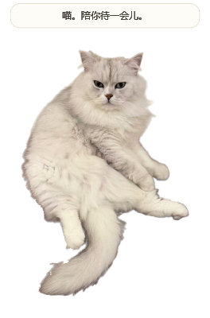

# 猫咪桌宠 · Desktop Pets

给我的好闺闺的桌宠。

新增 **桌宠工坊跨平台内测**：在 [platform/](platform/README.md) 中用照片制作、预览并保存自己的宠物包。网站与 Windows / Mac M 系列 / Mac Intel 客户端共用动作和文件格式。[v0.5 内测下载](https://github.com/flyallz/desktop_pets/releases/tag/v0.5.0-beta.2) · [跨平台检查](https://github.com/flyallz/desktop_pets/actions/workflows/platform-build.yml) · [后续产品路线](docs/product-roadmap.md)。

下文保留原来的 Windows v0.4.1 独立样品说明，该样品不能导入新版宠物包。

Windows 桌面猫咪陪伴样品：默认会自己在桌面走动、坐着陪伴、伸懒腰和打盹。保留原照坐姿，坐着时会眨眼、轻动耳朵、摆动尾尖；睡觉时有缓慢呼吸，轻点会醒来并伸个懒腰。

当前版本：v0.4.1。新姿态由内置图像工具参考这只猫生成，再在本机清理背景；它们是照片衍生素材。



## 下载运行

从 [GitHub Releases](https://github.com/flyallz/desktop_pets/releases/latest) 下载 Windows 压缩包，解压后双击其中的 `猫咪桌宠.exe`。更新前先通过猫咪或托盘的右键菜单退出旧版。

## 从源码编译

目标环境：Windows 10 / 11，64 位，已安装 .NET Framework 4.8。编译使用 Windows 自带的 .NET Framework C# 编译器，无需安装 Python、Node.js 或额外编译包。

在 PowerShell 中进入仓库目录，运行：

```powershell
.\build.ps1
```

生成文件位于 `发布包\猫咪桌宠.exe`，双击即可运行。图片和图标已嵌入 EXE，可以单独复制给朋友。

## 使用

- 左键按住猫咪拖动；轻点猫咪，会慢眨眼并显示短暂回应。
- 默认开启“自动切换动作”：启动约 6 秒后先走一小段，随后在原地陪伴、行走、伸懒腰和打盹之间轮换；每轮都会包含这些动作，顺序会变化。
- 行走使用 8 帧迈步动作，一次完整行走约 5～8 秒，起步和收步逐渐变速；到当前屏幕工作区边缘会停顿约 0.3 秒再转向，随后逐渐起步，拖动或打开右键菜单时停下。结束拖动后至少留出约 8 秒，再自动选择下一动作。
- 右键“走一走”可立即行走；取消勾选“自动切换动作”可停止后续自动活动，并立即停止当前行走。手动动作仍可使用。
- 右键“伸个懒腰”：完成约 3 秒的伸展后回到坐姿。
- 右键“睡一会儿”：趴着睡觉，直到轻点它或选择“叫醒它”；醒来会睁眼、伸懒腰，再坐好。
- 自动动作之间会原地停留约 7～13 秒；自动小睡约 32 秒后醒来，手动选择的睡觉会等你叫醒。
- 右键可选择大小、暂停全部动作、隐藏、回到右下角或退出。暂停会停在当前姿态；恢复后继续。手动选择行走、伸懒腰、睡觉或叫醒会恢复动作。
- 隐藏后，在任务栏右侧托盘找到猫咪图标，双击或选择“显示猫咪”恢复。
- 运行时不联网，不设置开机自启，不记录屏幕内容。重启后恢复默认位置和大小。

姿态内部用局部动画保留毛发和轮廓，睡着与醒来的图使用相同位置，只过渡眼睛区域。坐姿、伸展和趴下之间目前采用关键姿态切换，还不是逐帧连续的起卧动画。行走已有 8 帧循环，转向会先短暂停顿，再切换左右镜像，尚无连续转身画面；生成帧仍有少量毛发和轮廓差异。

## 文件说明

| 文件 | 用途 |
|---|---|
| `src/CatPet.cs` | 独立 Windows 程序及自身验证入口 |
| `src/PhotoMotion.cs` | 原照局部动画、行走帧、自动轮换和动作命中区域 |
| `src/app.manifest` | Windows 权限和显示缩放声明 |
| `assets/cat.png` | 原照抠图的坐姿 |
| `assets/cat-stretch.png` | 伸懒腰姿态 |
| `assets/cat-rest.png`、`assets/cat-sleep.png` | 对齐的醒来与睡觉素材 |
| `assets/cat-walk-0.png` 至 `cat-walk-7.png` | 对齐的 8 帧行走素材 |
| `assets/cat.ico` | 程序图标 |
| `build.ps1` | 将代码和素材编译为一个 EXE |
| `tools/` | 可选的本地照片抠图和行走图集处理脚本 |
| `requirements-image.txt` | 已验证的图片处理依赖版本 |
| `docs/verification.txt` | 本机样品验证记录 |
| `docs/pose-assets.md` | 新姿态来源、处理方式与生成提示词 |

仓库不包含原始房间照片、下载模型、开发环境或临时构建结果。使用现有素材编译时不需要下载模型。

## 验证

编译后运行程序自身的检查模式：

```powershell
$qaPath = Join-Path $PWD 'qa'
$petExe = Join-Path $PWD '发布包\猫咪桌宠.exe'
$check = Start-Process -FilePath $petExe -ArgumentList @('--self-test', ('"' + $qaPath + '"')) -PassThru -Wait
$check.ExitCode
Get-Content .\qa\verification.txt
```

退出码 `0` 表示检查通过。当前本机记录为 99 项通过，详情见 `docs/verification.txt`。检查覆盖透明图片、窗口、鼠标穿透、尺寸、点击反馈、暂停、托盘和隐藏恢复；还检查动作曲面不会翻折、脚掌像素保持稳定、摆尾后的命中区域，以及真实计时器驱动的慢眨眼。

检查会输出 `qa/pet-preview.png`、`qa/motion/` 下的原有动作图，以及 `qa/postures/` 下的新姿态对照图和 180 张演示帧。新检查覆盖睡眠保持、点击叫醒、自动小睡、动作中途切换、姿态变换后的透明鼠标区域和新素材的真实透明通道。

v0.4 增加 `qa/walking/` 中的双向行走帧和演示帧。检查覆盖八帧顺序、镜像后的鼠标命中区域、启动后无人操作的自动轮换、关闭与重开自动模式、边缘转向、步幅与移动距离，以及拖动、菜单、暂停、隐藏时的停止行为。

v0.4.1 另外检查起步与收步的变速、完整步态循环、不同计时间隔下的总距离一致性，以及边缘停顿后向内转向并逐渐起步。

6 分钟的模拟行为序列用于检查流程，不代表 6 分钟实机试用或不同电脑的帧率表现。

这些检查不代替真实鼠标拖动、托盘点击、混合缩放多屏和其他电脑上的实机试用。

## 更换猫咪图片

这版所有姿态共用 953 × 1347 透明画布，动作坐标专门对应当前猫咪。换猫或改变图片裁剪后，需要在 `src/PhotoMotion.cs` 中重新校准局部动作、睡觉眼睛区域和落脚位置，不能只换图片就得到正确动作。PNG 应有真实透明背景、完整轮廓及少量边距。更新图片、图标与坐标后，再运行 `build.ps1`。

若需复现本次本地抠图流程，可使用 Python 3.11：

```powershell
python -m venv .venv
.\.venv\Scripts\python.exe -m pip install -r requirements-image.txt
.\.venv\Scripts\python.exe tools\download_model.py
.\.venv\Scripts\python.exe tools\make_cutout.py "C:\path\to\your-cat.jpg"
.\build.ps1
```

首次下载的 IS-Net 模型约 179 MB，保存在 `.build/models/`，脚本会验证官方校验值。抠图在本机完成；结果写入 `assets/`，对照预览写入 `qa/`。脚本会覆盖这两个目录中同名的生成素材，更换前请保留自己的版本。

`make_cutout.py` 中的木地板残影清理针对当前白猫坐在木地板上的示例；更换为其他毛色、宠物或背景时，应重新检查边缘，必要时调整这部分处理。它尚不是通用的照片定制服务。

模型和预处理参考：[rembg IS-Net 实现](https://github.com/danielgatis/rembg/blob/main/rembg/sessions/dis_general_use.py)。

行走图集使用内置图像工具生成，随后用 `python tools/prepare_walk.py "C:\path\to\walking-atlas.png"` 在本地抠出 8 帧；该脚本针对本次绿色背景、4 × 2 排列的图集。处理会覆盖 `assets/cat-walk-0.png` 至 `cat-walk-7.png`，并输出对齐检查图。具体来源和提示词见 `docs/pose-assets.md`。

## 后续产品方向

网页可负责上传照片、确认形象、选择动作和配置功能；桌面程序负责悬浮、互动和本地提醒。下一步以猫主人的试用反馈为依据，再决定是否制作自助定制网站。